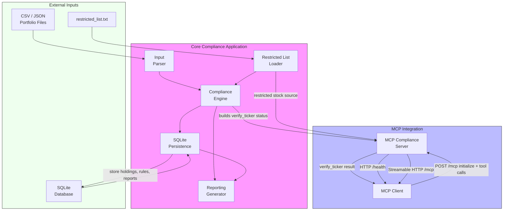

# Portfolio Compliance Checker Solution Design Diagram

## Overview
This diagram shows the main system components, data flows, and MCP integration for the Portfolio Compliance Checker.

## Notes
- The Input Parser normalizes portfolio data into internal `Holding` objects.
- The Compliance Engine evaluates ticker holdings against rules and the restricted list.
- SQLite Persistence stores holdings, compliance rules, and generated reports for auditability.
- The MCP Compliance Server exposes `verify_ticker` as a tool via Streamable HTTP.
- The MCP Client uses `ClientSession` with `streamable_http_client` to call the server.
